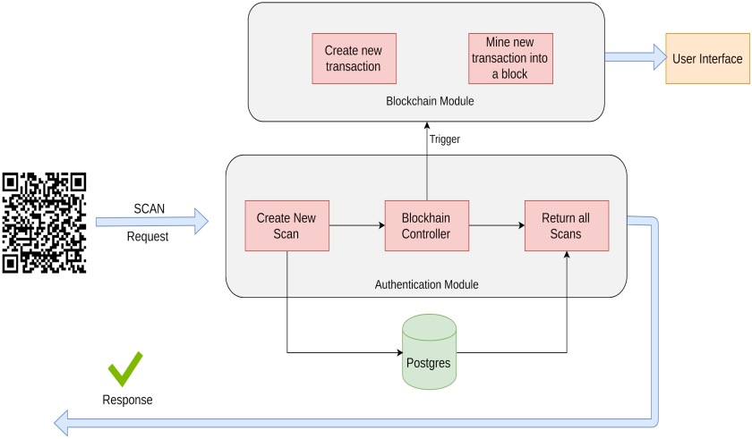

# QR code-based Lab Resource management using Ethereum Blockchain

In this project we propose decentralised,secure,immutable, distributed,QR
code application based on Ethereum blockchain to solve problems of tradional
centralised databases.blockchain system operates across a peer-to-peer (P2P) network where every network peer shares the computing load and maintains complete
copies of the data. As more peers enter the network, the greater system scales
up to handle more records traffic. More peers also means greater availability and
fault tolerance for the blockchain database. Second, the contents of an immutable
ledger (database) are all related or linked together. Every record, or set of records,
added to the ledger represents a block of data. Every block links to the previous
block by including a cryptographic hash, a timestamp and transaction metadata.
Thus, every block connects to form a growing ”chain” of blocks deriving the term
blockchain to create secure and immutable records. A record cannot change without altering the cryptographic hash.

# Block Diagram
   

# Work Flow
   

# User Interface
   

# Blockc Diagram
   

# Implementations in this project.

Steps: 
* In Perspective of user,user is able to do the following things in the specified order to view details of the scanned product:

* Scan QR code(example Fig 3) of the Device using any scanner present on mobile phone.

* The scan will open a url in the browser,the device info is requested from the Authentication Module.Authentication module verifies if it is a genuine request, if yes, it send request to smart contract and sends response with the Device information.

- Browser open the url containing information of device.

# Tech & Dependencies

* Ethereum 
* Truffle
* OpenZeppelin 
* Javascript
* PHP
* Metamask 
* Solidity 
